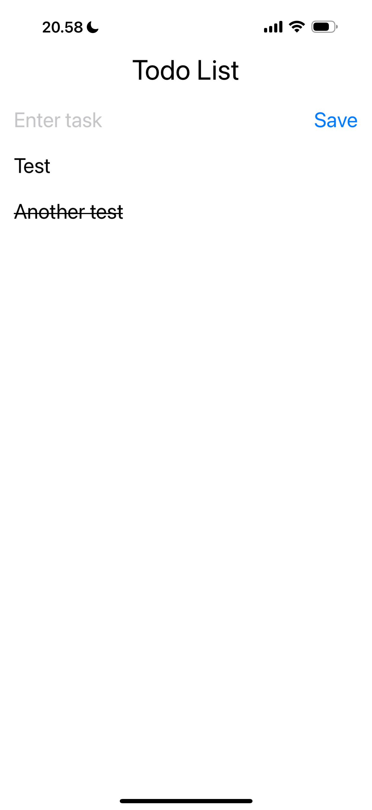

# Web-ja-hybriditeknologiat-mobiiliohjelmoinnissa-viikkotehtava-4

## Excercise. Todo list

Todo list app enables user to create list of tasks. Data is saved into phone’s memory. User can also mark task as done/undone.

## Implemented UI

